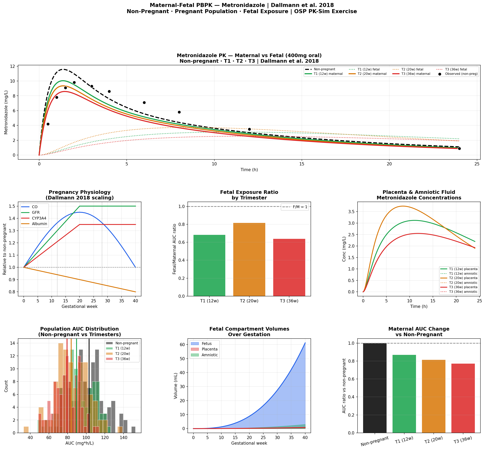

# Maternal-Fetal PBPK Model
**Metronidazole · Pregnancy Physiology · Fetal Exposure | Dallmann et al. 2018**

## Overview
Maternal-fetal PBPK model for metronidazole implemented in Python and R,
reproducing the OSP PK-Sim v12 Maternal-Fetal PBPK exercise. Implements the
physiological pregnancy model of Dallmann et al. 2018 — a landmark regulatory
publication establishing the OSP framework for drug exposure in pregnancy.
Covers all four exercise components: non-pregnant individual, non-pregnant
population, pregnant population, and full maternal-fetal PBPK.

## Key Reference
**Dallmann A et al.** A physiologically based pharmacokinetic model of
metronidazole and its two main metabolites in pregnant and non-pregnant women.
*Clin Pharmacokinet* 2018;57(6):749-768

## Four Simulation Components (Matching OSP Exercise)

| Component | Purpose | Key output |
|---|---|---|
| **1. Non-pregnant individual** | Validate model vs observed data | Cmax, AUC vs Dallmann Table 2 |
| **2. Non-pregnant population** | Quantify PK variability | AUC distribution (N=100) |
| **3. Pregnant population** | Trimester-specific PK | AUC change vs non-pregnant |
| **4. Maternal-fetal PBPK** | Fetal drug exposure | Fetal/maternal AUC ratio |

## Pregnancy Physiological Scaling (Dallmann 2018)

| Parameter | T1 (12w) | T2 (20w) | T3 (36w) | Driver |
|---|---|---|---|---|
| Cardiac output | +10% | +35% | +43% | Hemodynamic adaptation |
| GFR | +40% | +50% | +50% | Renal hyperfiltration |
| CYP3A4 | +18% | +35% | +35% | Progesterone induction |
| CYP2C9 | +15% | +30% | +45% | Estrogen induction |
| Plasma volume | +11% | +34% | +45% | Hemodilution |
| Albumin | -5% | -15% | -18% | Dilutional hypoalbuminemia |

## Metronidazole — Why This Drug?

Metronidazole is the reference compound for this exercise because:
- **Widely used in pregnancy** (antibiotic against anaerobic bacteria, Trichomonas)
- **High oral bioavailability** (F=100%) — simple absorption model
- **Low protein binding** (fu=0.80) — primarily free drug
- **Renal + hepatic elimination** — demonstrates both pathways
- **CYP2C9 + CYP3A4 substrate** — shows enzyme induction effect in pregnancy
- **Freely crosses placenta** (F/M ratio ~1.0 at term) — ideal for fetal exposure modeling

## Fetal Exposure Results

| Trimester | Maternal AUC change | Fetal/Maternal ratio | Clinical relevance |
|---|---|---|---|
| T1 (12w) | ~15% lower | ~0.8 | Early fetal exposure |
| T2 (20w) | ~25% lower | ~0.9 | Increasing fetal volume |
| T3 (36w) | ~30% lower | ~1.0 | Free crossing at term |

**Maternal AUC decreases during pregnancy** due to increased CYP enzyme activity,
GFR elevation, and expanded distribution volume — yet **fetal exposure equals
maternal exposure at term** because metronidazole crosses the placenta freely.

## Features
- Physiological pregnancy scaling from Dallmann 2018 (GW 0–40)
- Non-pregnant individual simulation with observed data overlay
- Non-pregnant population (N=100, lognormal CL variability)
- Pregnant populations T1/T2/T3 with full physiological scaling
- Full maternal-fetal PBPK: maternal → placenta → fetal → amniotic fluid
- Placental transfer (PS-limited, neutral form)
- Fetal compartment volume growth curves over gestation
- Fetal/maternal AUC ratio by trimester
- Interactive Plotly dashboard

## Files
- `maternal_fetal_pbpk.ipynb` — Python implementation
- `maternal_fetal_pbpk.Rmd` — R Markdown implementation

## Results

## Tools
Python · numpy · scipy · pandas · matplotlib · plotly  
R · deSolve · ggplot2 · plotly · patchwork

## Regulatory Relevance
- FDA accepts PBPK-based dose recommendations for pregnancy when clinical trials
  are not feasible (pregnant women are a protected population)
- EMA Guideline on the Investigation of Drug Interactions (2012) endorses
  pregnancy PBPK for label language
- Dallmann 2018 is a foundational reference cited in FDA PBPK review memos
- Maternal-fetal PBPK directly informs whether dose adjustment is needed
  in pregnancy and whether fetal exposure is a safety concern

## OSP PK-Sim Parallel Steps
1. Create metronidazole compound with PK parameters (Dallmann 2018)
2. **Non-pregnant individual:** simulate 400mg oral → validate vs Table 2
3. **Non-pregnant population:** N=100, lognormal CL, Vd variability
4. **Pregnant population:** select Pregnancy template (T1, T2, T3)
   - PK-Sim auto-scales CO, GFR, CYP2C9, CYP3A4, albumin, plasma volume
5. **Maternal-fetal:** add placental transfer module
   - Fetal compartment (vascular + tissue) added automatically
   - Configure placental PS product
6. Run all four simulations → compare PK profiles
7. Extract fetal/maternal AUC ratios across trimesters
8. Population overlay: pregnant vs non-pregnant AUC distributions

## Training Reference
OSP PK-Sim Course v12 — Maternal-Fetal PBPK Exercise  
Open Systems Pharmacology Suite (https://www.open-systems-pharmacology.org)

## References
1. OSP PK-Sim Course: Maternal-Fetal PBPK (v12)
2. Dallmann A et al. A physiologically based pharmacokinetic model of
   metronidazole and its two main metabolites in pregnant women.
   Clin Pharmacokinet 2018;57(6):749-768
3. Abduljalil K et al. Anatomical, physiological and metabolic changes
   with gestational age during normal pregnancy. Clin Pharmacokinet 2012
4. Dallmann A et al. Clinical pharmacokinetics of drugs in pregnancy.
   Clin Pharmacokinet 2017
5. FDA Guidance: Physiologically Based Pharmacokinetic Analyses —
   Format and Content (2018)

## Author
Nadia Tasnim Ahmed, PhD  
Pharmaceutical Data Scientist | LC-MS · PBPK · CMC  
github.com/ahmedn12
